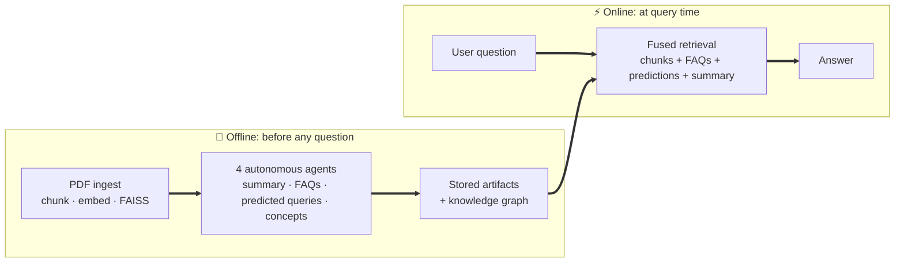
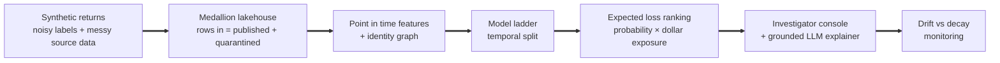
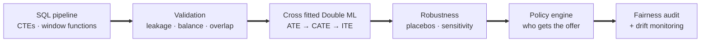
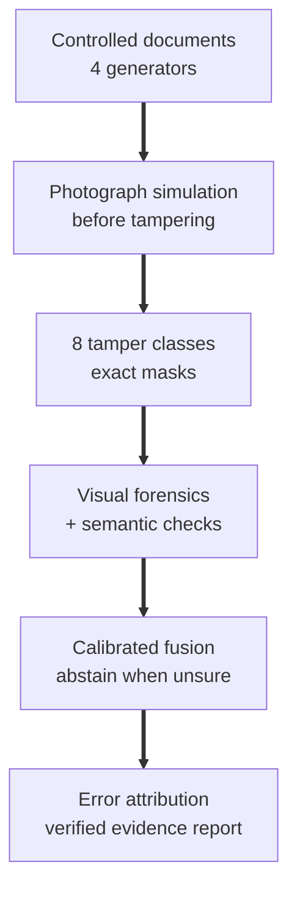

# Phanindra Reddy Mathireddy

### AI/ML Engineer &nbsp;·&nbsp; Data Scientist

**I build machine learning systems that answer real business questions and hold up in production: agentic LLM pipelines, fraud and risk models, and causal inference for pricing decisions.**

🎯 **Open to AI/ML Engineer and Data Scientist roles** &nbsp;·&nbsp; 📫 phanindra2608@gmail.com

 

| 🧪 **4** | ✅ **128** | 🌐 **4** | 🔁 **4 of 4** |
|:---:|:---:|:---:|:---:|
| end to end case studies | automated tests | live services you can click | repos with passing CI |

---

## 🧭 What I Bring

| 🤖 Generative AI & Agents | 🛡️ Fraud & Risk ML | 📈 Causal Inference & Decision Science |
|---|---|---|
| Multi agent pipelines, RAG with FAISS and knowledge graphs, LLM cost and latency benchmarking, grounded LLM output with verification and safe fallbacks | Point in time features, automated leakage tests, identity graphs, cost aligned evaluation, expected loss ranking, drift versus decay monitoring | Double Machine Learning, ATE / CATE / ITE estimation, uplift and policy optimization, experiment design and power analysis, fairness audits |

---

## 📂 Case Studies

Each project starts from a business question, is validated against something checkable, and ships as a tested, containerized service. **Skim the table, then open any case study below.**

| Case study | The question it answers | Headline result | Try it |
|---|---|---|---|
| 🧠 **[SleepMind AI](#sleepmind)** Agentic RAG · Generative AI | Can an AI assistant do its thinking *before* the user asks? | Four offline agents benchmarked head to head against traditional RAG on latency, tokens, cost, and break even query volume | [API](https://sleepmind-ai-api.onrender.com/docs) · [Dashboard](https://sleepmind-ai-dashboard.onrender.com) |
| 🪃 **[Boomerang](#boomerang)** Fraud Detection · Risk ML | Which retail returns should an investigator look at first? | The simplest model won: **$1,049 net saved**, 2.4x the best XGBoost variant | [Code](https://github.com/Phani-2608/Boomerang) · runs locally |
| 💲 **[Pricing Heterogeneity](#pricing)** Causal Inference · Decision Science | Who should actually get a discount? | **+32.5% profit** versus discounting everyone, with **17 of 17** validation checks passing | [API](https://pricing-heterogeneity-api.onrender.com/docs) · [Dashboard](https://pricing-heterogeneity-dashboard.onrender.com) |
| 🧾 **[Ledger Forensics](#ledger-forensics)** Document Fraud · Multichannel Forensics | Where does automated receipt and invoice tampering detection actually break? | Fused visual and semantic evidence reached **0.905 ROC AUC**; error attribution traced every wrong decision to its originating stage | [Code](https://github.com/Phani-2608/ledger-forensics) · runs locally |

⏱️ Live demos run on free tier hosting, so the first click may take 30 to 60 seconds to wake the service.

 

## 🧠 Case Study 1 · SleepMind AI

**Agentic RAG with Sleep Time Compute: do the expensive reasoning offline, so answers arrive faster and cheaper online.**

| | |
|---|---|
| **Problem** | Traditional RAG pays the full cost of retrieval and reasoning on every query while the user waits, and asking a similar question twice never gets cheaper. |
| **Approach** | Four autonomous agents (Summary, FAQ Generator, Future Query Predictor, Concept Extractor) analyze each paper before any question arrives. At query time, source chunks, pregenerated FAQs, predicted question and answer pairs, the summary, and a PageRank weighted knowledge graph are fused into one context. |
| **Evidence** | A controlled benchmark runs the same question set through both pipelines, measuring latency, tokens, cost per query, and source coverage, tracked in MLflow with regression detection. A break even model computes how many queries it takes for offline compute to pay for itself. |
| **Engineering** | 27 fully mocked tests (CI runs without an API key), FastAPI service, Streamlit dashboard, Docker Compose, content hashed artifacts, retry and timeout logic on every agent, secrets resolved only from the environment. |

<b>📖 Read the full case study</b>

 

#### The driving question
Most RAG systems spend all of their compute at the worst possible moment: while a person is waiting. The question behind SleepMind was whether the understanding of a document could be done once, ahead of time, and then amortized across every future query against it.

#### How it works
* **Ingestion.** PyMuPDF extracts the paper text, which is cleaned, chunked into overlapping windows, embedded, and indexed in FAISS.
* **Sleep time agents.** Each agent inherits from a shared base class that provides retries, configurable timeouts, structured JSON output, and a safe default on failure, so one failing agent can never crash the pipeline. The FAQ Generator produces 20 question and answer pairs across difficulty levels; the Future Query Predictor produces 15 likely questions ranked by probability, with answers prepared in advance.
* **Knowledge graph.** Concept Extractor output becomes a NetworkX directed graph with PageRank scoring, so the most central concepts get priority in retrieval.
* **Query time.** Traditional RAG retrieves only source chunks. Sleep Time RAG fuses chunks, FAQs, predicted answers, and the summary into a richer context window.

#### How it was evaluated
The same question set runs through both pipelines, comparing latency, token consumption, cost per query, and number of retrieval sources. Every run is logged to MLflow and a run log that flags regressions in latency or cost. The cost break even model answers the question any team shifting compute to preprocessing has to ask: *after how many queries does this pay for itself?*

#### Engineering decisions
* Tests mock the LLM call, not the agent logic, so every agent is testable in isolation and CI never needs a live key.
* The same ingestion engine and FAISS index serve both the pipeline and the API, keeping training and serving consistent.
* Every saved artifact carries a SHA256 content hash, so any output can be traced to the run and configuration that produced it.
* No hardcoded secrets anywhere: keys come from environment variables, and `.env` is git ignored.

**What this proves:** agentic system design beyond a single LLM call, quantitative LLM evaluation, cost engineering, and production discipline.

 

## 🪃 Case Study 2 · Boomerang

**Retail return fraud detection, built the right way: honest data, leak proof features, and a champion model chosen by dollars saved.**

| | |
|---|---|
| **Problem** | Fraud models that look great on paper fail in production for three reasons: features that leak the future, a metric that does not match how the model is used, and silent drift after launch. Boomerang designs around all three and proves it. |
| **Approach** | Deliberately honest synthetic data (noisy investigator labels, injected source system mess) flows through a medallion lakehouse into point in time correct features and an identity graph, then a full model ladder evaluated on a temporal split. |
| **Result** | Graph augmented XGBoost had the best ranking score, but **plain logistic regression saved the most money: $1,049 versus $437.** The champion is chosen by economics, not by the prettiest metric. Net savings peak at about **5% of cases reviewed** and turn negative past about 15%, which directly sizes the investigation team. |
| **Engineering** | 34 tests covering leakage, data quality, evaluation, API contract, and LLM grounding. FastAPI scoring service, investigator operations console, Docker Compose, a parallel Databricks and Spark implementation, and a full rebuild from nothing in under a minute. |

<b>📖 Read the full case study</b>

 

#### Data that does not flatter the model
No public dataset carries real return fraud labels, so the data was generated to be honest rather than convenient. Fraudsters also make ordinary returns, part of the fraud is driven by a factor that appears in no feature (capping what any model can reach), about 10% of real fraud is never caught by investigators, and the data includes wrong sign refunds, clock skew timestamps, duplicate records, and late corrections.

#### A pipeline that cannot silently lose a row
Bronze, silver, and gold stages enforce a hard invariant before publishing: rows in must equal rows published plus rows quarantined, and every quarantined row carries a reason. Deduplication is a business key merge ordered by when the source system asserted each version, so a late correction never double counts revenue.

#### Features that cannot cheat
Every history feature uses only events strictly before the return being scored. A test suite recomputes a sample of features by brute force with a plain timestamp filter and fails the build if the fast production version disagrees. A second check fails the build if any single feature predicts the label suspiciously well on its own, the classic signature of a leak. An identity graph over shared devices, addresses, and payment methods adds relational features that **improved every model tried**.

#### Honest model comparison
Accuracy was never used: at this fraud rate, predicting "not fraud" every time is over 95% accurate and stops nothing.

| Model | Ranking quality | Precision at 5% | Fraud $ caught | Net $ saved |
|---|---:|---:|---:|---:|
| Logistic regression + graph features | 0.304 | 0.340 | $2,185 | $937 |
| XGBoost + graph features | 0.301 | 0.298 | $1,663 | $437 |
| **Plain logistic regression** | 0.266 | **0.362** | **$2,293** | **$1,049** |
| Hand written rule (baseline) | 0.087 | 0.149 | $859 | negative $391 |

#### From a score to a decision
Cases are ranked by expected loss (probability of fraud times dollar exposure), so a moderate risk $900 refund outranks a near certain $20 one. The monitoring layer separates **drift** (the world changing) from **decay** (the model going wrong): in one run, a tenure feature drifted heavily while performance held, and the system correctly recommended watching rather than retraining.

#### An LLM that explains but never decides
A local LLM turns each case's evidence into plain English for investigators. Every number it writes is checked against the evidence packet; any unverifiable number discards the explanation in favor of a template built from the same evidence. The same fallback runs when the LLM is unavailable, so the system never depends on it.

**What this proves:** fraud and risk systems thinking beyond the model: data honesty, leakage proof feature engineering, cost aligned evaluation, monitoring judgment, and a language model constrained to narration.

 

## 💲 Case Study 3 · Pricing Heterogeneity

**Causal inference for customer pricing: estimate who responds to a discount, turn it into a targeting policy, and audit that policy before it ships.**

| | |
|---|---|
| **Problem** | "Should we discount everyone?" A naive model confounds the effect of price with every other reason a customer buys, and a single average hides who actually responds. |
| **Approach** | 12,000 synthetic customers with a **known true treatment effect**, so every estimator can be checked against reality. Multi table SQL with CTEs and window functions, cross fitted Double Machine Learning for ATE, CATE, and ITE, then a policy engine that turns individual effects into per customer offers. |
| **Result** | Discounting everyone **destroys 21.2% of profit** versus discounting no one. The ITE targeted policy **beats discounting everyone by 32.5%**. |
| **Engineering** | 33 tests, ruff linting, CI across Python 3.10 and 3.11, FastAPI scoring API, Streamlit decision simulator, versioned model registry, SHAP explanations, PSI and treatment effect drift monitoring. |

| Verified against ground truth | Value |
|---|---|
| Estimated ATE vs true ATE | 7.3% vs 6.0% (95% CI 5.65% to 8.88%) |
| CATE vs truth correlation | **0.715** |
| GATES rank correlation | 0.939 |
| Validation checks (incl. placebo and sensitivity tests) | **17 of 17 pass** |
| Fairness audit (four fifths rule) | **Fails at 0.373, documented rather than hidden** |

<b>📖 Read the full case study</b>

 

#### Why causal, not predictive
A model that predicts purchases well but was trained on confounded data will still recommend the wrong pricing policy. Causal validity outranks predictive fit here, so the estimation is built to separate the effect of the discount from everything correlated with receiving it.

#### The estimation hierarchy
* **Experiment design first:** hypothesis tests, sample size and minimum detectable effect calculators, Bonferroni corrected segment tests.
* **Cross fitted Double ML (DR learner):** nuisance models for outcome and propensity are fit on separate folds, avoiding the regularization bias of naive plug in estimators. Analytic and bootstrap confidence intervals agree.
* **ATE, then CATE, then ITE:** from one average, to segments, to a single customer, with three tier ITE segmentation checked for stability across regions.
* **Diagnostics:** covariate balance before and after IPW, overlap and positivity checks, GATES calibration, and Qini.

#### Trying to break the result
Placebo treatment and placebo outcome tests, an unmeasured confounder sensitivity analysis, and subgroup stability checks. All 17 validation checks pass, and every number in the project is reproduced from a single results file.

#### From estimates to a decision
Five strategies were compared on profit, ROI, and incremental conversions: treat none, treat all, random, segment based, and ITE targeted. The winning policy was then audited across age groups, and it **fails the four fifths rule**. That result is reported in the README, on the dashboard, and in the results file, because a profitable policy that is unfair to ship is not a finished answer.

**What this proves:** causal inference beyond correlational ML, statistical rigor checked against ground truth, decision making under business constraints, and the integrity to surface an inconvenient result.

## 🧾 Case Study 4 · Ledger Forensics

**Multichannel receipt and invoice fraud detection that measures not only whether the system is wrong, but which stage caused the error.**

| | |
|---|---|
| **Problem** | Document fraud detectors can hide behind one aggregate score, even when OCR, visual evidence, semantic reconciliation, or decision calibration is the real source of failure. |
| **Approach** | Controlled receipt and invoice generation with exact pixel masks, eight tamper classes, independent visual and semantic channels, logistic fusion, calibration, abstention, and counterfactual error attribution. |
| **Result** | The fused model reached **0.905 ROC AUC** and **0.947 PR AUC**. On a completely held out document generator it reached **0.916 ROC AUC**, showing that it did not merely learn the synthetic renderer. |
| **Engineering** | 34 tests across Python 3.10, 3.11, and 3.12, a CI rebuild from nothing, FastAPI, Streamlit, Docker, seeded experiments, and verified evidence reports with optional LLM narration. |

<b>📖 Read the full case study</b>

 

#### The driving question
The goal was not to claim that every forged receipt can be detected. It was to measure where document fraud detection actually breaks, then make those limits visible instead of hiding them behind one headline metric.

#### Evidence with exact ground truth
Four document generators create controlled receipts and invoices. Eight tamper classes alter them after photograph simulation, preserving exact masks for every edited pixel. Independent visual forensics and semantic reconciliation channels are evaluated alone and together, then calibrated against operating cost. A held out generator with a different font, layout, paper, and ink tests whether performance survives beyond the rendering templates used for training.

#### The result that changed the engineering priority
Fusion improved ranking, but the visual channel caught **0% of tampered documents independently**. Its value was limited to sharpening scores on documents that semantic checks had already identified. That makes ledger reconciliation the load bearing component and pixel analysis a refinement, not a second line of defence.

The project also refuses to disguise its blind spots. Copy move tampering and reprints were not detected at the chosen operating point. Localisation was strong for digit substitution but weak for splice. An OCR error sweep showed that reading errors increased false alarms far faster than they improved detection.

#### Explaining every wrong decision
Counterfactual repair traced five wrong decisions to their originating stage: 40% were visual false alarms, 40% had no usable evidence, and 20% were semantic blind spots. The evidence report can use an LLM for narration, but every number is checked and a deterministic template takes over when verification fails.

**What this proves:** computer vision and semantic system design with measurable failure boundaries, honest generalization tests, calibrated decisions, and error attribution that identifies what should be improved next.

 

---

## 🛠️ Toolkit

| | |
|---|---|
| **Languages** |   |
| **ML & Statistics** |       |
| **Generative AI** |     |
| **Data Engineering** |    |
| **MLOps & Serving** |        |
| **Cloud** |    |

## 🏅 Certifications

## ⚙️ How I Work

* **Business question first.** Every project starts from a decision someone has to make, not from a dataset.
* **Validate against something checkable.** Ground truth, brute force recomputation, placebo tests, controlled benchmarks.
* **Report the inconvenient result.** The simpler model that wins, the fairness audit that fails.
* **Ship it.** Tests, CI, containers, a live endpoint, and monitoring, not a notebook that only has to run once.

---

**Hiring for AI/ML Engineering or Data Science? Let's talk.**

<a href="https://phanindra26.netlify.app/">Portfolio</a> &nbsp;·&nbsp; <a href="https://www.linkedin.com/in/phanindra26/">LinkedIn</a> &nbsp;·&nbsp; <a href="mailto:phanindra2608@gmail.com">phanindra2608@gmail.com</a>

